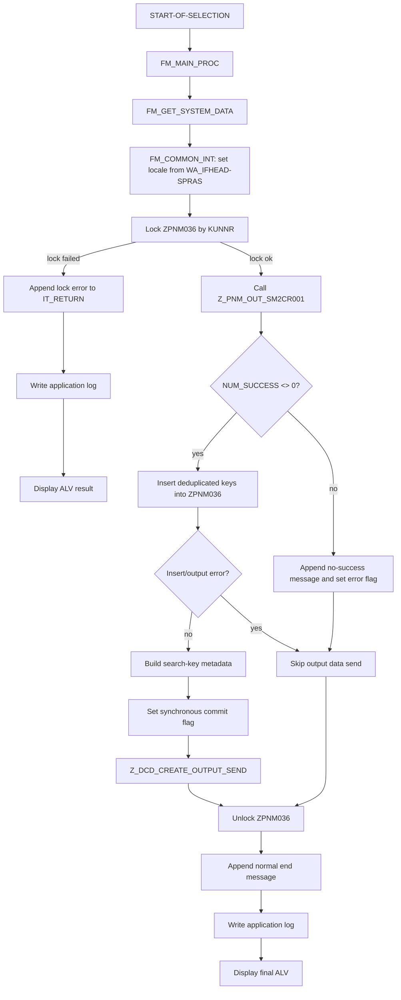

# Function Specification: ZPNMB023

## 1. Document Scope

This specification is based on the ABAP source exported from SE38 on 2026-07-03 into:

`D:\SAPskillhub\output\se38_export_ZPNMB023_20260703_082803`

The analyzed program set excludes `SAPLSE16N.abap`, which was exported only as a validation program for the SE38 export process.

## 2. Program Overview

`ZPNMB023` is an executable report for sending/registering customer-facing individual identification number data.

Header comments describe the Japanese program name and overview as:

- Program name: `得意先向け個体識別番号送信`
- Program overview: `得意先向け個体識別番号送信`
- Design reference: `MM_Z053`
- Runtime condition: SAP S/4HANA server only
- Message class: `ZPNM001`

Functionally, the report is an orchestration program. It validates the selection-screen input, checks authorization, locks by customer, calls a business data extraction/output function module, records successful output keys in table `ZPNM036`, delegates EAI/file output and application logging to the common delivery include `ZDCDF001`, and finally displays an ALV processing-result screen.

The report itself does not directly SELECT the detailed business output data. That data is produced by function module `Z_PNM_OUT_SM2CR001`.

## 3. Exported Source Set

### 3.1 INCLUDE Hierarchy

```text
ZPNMB023
├─ ZPNMB023TOP
├─ ZDCDF001
│  ├─ ZDCDF001TOP
│  └─ ZDCDF001F01
└─ ZPNMB023F01
```

### 3.2 Program Roles

| Program | Exported file | Role |
|---|---|---|
| `ZPNMB023` | `ZPNMB023.abap` | Main report, event blocks, include composition |
| `ZPNMB023TOP` | `ZPNMB023-INCLUDE-ZPNMB023TOP.abap` | Business-specific global data, constants, selection screen |
| `ZPNMB023F01` | `ZPNMB023-INCLUDE-ZPNMB023F01.abap` | Business-specific validation, authorization, main processing, `ZPNM036` insert, wrappers to common output |
| `ZDCDF001` | `ZPNMB023-INCLUDE-ZDCDF001.abap` | Common delivery/report include entry point; adds common initialization and selection-screen validation events |
| `ZDCDF001TOP` | `ZDCDF001-INCLUDE-ZDCDF001TOP.abap` | Common output/log globals, constants, interface/file selection block |
| `ZDCDF001F01` | `ZDCDF001-INCLUDE-ZDCDF001F01.abap` | Common file/EAI output, application log, ALV result display, dynamic label handling |

## 4. Selection Screen

The final selection screen is composed from `ZPNMB023TOP` and `ZDCDF001TOP`.

### 4.1 Business Selection Fields

| Field | Type | Required | Notes |
|---|---:|---:|---|
| `P_KUNNR` | `ZPNMEKUNNR` | Yes | Customer / receiver customer. Validated against `BUT000` and configured BP group. |
| `P_WERKS` | `T001L-WERKS` | Yes | Plant. Validated against `T001W`; also used for company-code authorization. |
| `S_LGORT` | `T001L-LGORT` | Yes | Storage location range. |
| `S_MATNR` | `MATNR` | Yes | Material range. |
| `S_BUDAT` | `BUDAT` | Yes | Posting/transfer date range; `NO-EXTENSION`. |
| `S_LIFNR` | `LIFNR` | No | Vendor range. |
| `S_IDETF` | `ZPNMEIDETFH` | No | Individual identification number; `NO INTERVALS`. |
| `S_CHARG` | `MCHB-CHARG` | No | Batch number; `NO INTERVALS`. |
| `CB_RCVR` | Checkbox | No | Recovery/re-send flag passed to `Z_PNM_OUT_SM2CR001` as `I_RCVR`. |

### 4.2 Common Delivery Fields

These are provided by `ZDCDF001TOP` inside block `BL_COM1`.

| Field | Type | Required | Notes |
|---|---:|---:|---|
| `P_IFID` | `ZDCDEIFID` | Yes | Interface ID. Checked against `ZDCDIFT01`. |
| `P_SYSID` | `ZDCDESYSID` | Yes | System ID. Checked against `ZDCDIFT02`. |
| `CB_FOUT` | Checkbox | No | Allows output destination override. |
| `P_LOGFNM` | `C(60)` | Conditional | Logical file name. Mutually exclusive with direct path override. |
| `P_FPATH` | `ZDCDEFILEPATH` | Conditional | Output file path. Must be paired with `P_FNAME`. |
| `P_FNAME` | `ZDCDEFILENAME` | Conditional | Output file name. Must be paired with `P_FPATH`. |

The common block rejects inconsistent file override input:

- If `CB_FOUT` is checked, either logical file name or file path must be supplied.
- Logical file name and physical file path cannot both be supplied.
- Physical file path and file name must be supplied together.
- File output destination override is rejected when the interface send mode does not allow output table update.

## 5. Initialization Behavior

ABAP sees more than one `INITIALIZATION` block because the common include is placed before the main report's own initialization block.

Execution responsibilities:

1. `ZDCDF001` initialization calls `FM_ZDCDF001_INITIALIZATION`.
   - Clears `FLG_COMMIT_SYNC`.
2. `ZPNMB023` initialization calls `FM_INITIAL_PROC`.
   - Calls `FM_SET_LBLTEXT` to dynamically set common selection texts from DDIC data elements.
   - Calls `FM_GET_COMMON_PARM` to read common parameters.

`FM_GET_COMMON_PARM` retrieves two required values through `Z_DCD_COMMON_PARAMS`:

| Parameter ID | Target variable | Purpose |
|---|---|---|
| `BP_GROUP` | `WK_BU_GROUP` | BP grouping used to validate `P_KUNNR` in `BUT000`. |
| `OBJCT` | `WK_OBJCT` | Authorization object name used by `AUTHORITY-CHECK`. |

If either common parameter cannot be read, message `ZPNM001-602` is raised as an error.

## 6. Input Validation

### 6.1 Interface and File Output Validation

`AT SELECTION-SCREEN ON BLOCK BL_COM1` calls `FM_INPUT_CHECK_BL_COM1`.

Validation sequence:

1. `P_IFID` must exist in `ZDCDIFT01` where `LOEVM <> ABAP_TRUE`.
2. `P_SYSID` must exist in `ZDCDIFT02` where `LOEVM <> ABAP_TRUE`.
3. `Z_DCD_GET_FILEPARAM` is called with `WA_EXINFO-IFID` and `WA_EXINFO-SYSID`.
4. Returned `WA_IFHEAD` must not be initial.
5. File output override combinations are checked as described in section 4.2.

On validation failure, a `ZDCD001` message is displayed like an error and `LEAVE SCREEN` is executed.

### 6.2 Customer Validation

`AT SELECTION-SCREEN ON P_KUNNR` calls `FM_INPUT_CHECK_KUNNR`.

The program checks:

```abap
SELECT SINGLE PARTNER
  FROM BUT000
 WHERE PARTNER  = P_KUNNR
   AND BU_GROUP = WK_BU_GROUP.
```

Failure raises `ZPNM001-612`, with the configured BP group included in the message variables.

### 6.3 Plant Validation

`AT SELECTION-SCREEN ON P_WERKS` calls:

1. `FM_INPUT_CHECK_WERKS`
2. `FM_CHECK_AUTH`

`FM_INPUT_CHECK_WERKS` checks that `P_WERKS` exists in `T001W`. Failure raises `ZPNM001-612`.

### 6.4 Authorization Check

`FM_CHECK_AUTH` derives company code from plant by joining `T001W` and `T001K`:

```abap
SELECT BUKRS
  FROM T001W INNER JOIN T001K
    ON T001W~BWKEY = T001K~BWKEY
 WHERE T001W~WERKS = P_WERKS
 ORDER BY BUKRS.
```

It then performs:

```abap
AUTHORITY-CHECK OBJECT WK_OBJCT
  ID 'BUKRS' FIELD L_BUKRS
  ID 'ACTVT' FIELD '01'.
```

Behavior on authorization failure:

- Online mode: raises `ZPNM001-638` as an error.
- Background mode: displays the same message like an error and leaves the program.

## 7. Main Processing Flow

The `START-OF-SELECTION` event calls `FM_MAIN_PROC`.

### 7.1 High-Level Flow



### 7.2 Start Message and System Data

`FM_MAIN_PROC` calls `FM_GET_SYSTEM_DATA`, which delegates to `Z_DCD_EDIT_SYSDATA` to fill `WA_SYSDATA`.

The system data is later used when inserting `ZPNM036` audit fields:

- `CREDATE`
- `CRETIME`
- `CREUSER`
- `CREPROG`
- `CRETRAN`

The report displays start message `ZPNM001-641` with `P_KUNNR`.

### 7.3 Locale Handling

Before business output, `FM_COMMON_INT` sets the locale language:

```abap
IF WA_IFHEAD-SPRAS IS NOT INITIAL.
  SET LOCALE LANGUAGE WA_IFHEAD-SPRAS.
ENDIF.
```

This ties file/log/output formatting to the interface header language configured for the selected interface/system.

### 7.4 Locking

The report locks custom object/table area `ZPNM036` by client and customer:

```abap
CALL FUNCTION 'ENQUEUE_EZZZPNM036_1'
  EXPORTING
    MANDT = SY-MANDT
    KUNNR = P_KUNNR.
```

If locking fails:

- The system lock message is displayed.
- A business error message `ZPNM001-643` is appended to `IT_RETURN`.
- Application log output and ALV display are executed.
- Main processing returns without calling the business extraction module.

If locking succeeds, the report later calls `DEQUEUE_EZZZPNM036_1` with the same client and customer.

## 8. Business Data Extraction Interface

The central business data module is:

```abap
CALL FUNCTION 'Z_PNM_OUT_SM2CR001'
  EXPORTING
    I_KUNNR    = P_KUNNR
    I_WERKS    = P_WERKS
    IT_S_LGORT = S_LGORT[]
    IT_S_MATNR = S_MATNR[]
    IT_S_BUDAT = S_BUDAT[]
    IT_S_LIFNR = S_LIFNR[]
    IT_S_IDETF = S_IDETF[]
    IT_S_CHARG = S_CHARG[]
    I_RCVR     = CB_RCVR
  IMPORTING
    ET_RETURN     = IT_RETURN
    ET_OUTPUTDATA = IT_OUTPUTDATA
    ES_DATANUM    = L_WA_DATANUM.
```

Observed interface contract:

| Direction | Parameter | Type / Source | Meaning |
|---|---|---|---|
| Import | `I_KUNNR` | `P_KUNNR` | Customer / receiver customer |
| Import | `I_WERKS` | `P_WERKS` | Plant |
| Import | `IT_S_LGORT` | `S_LGORT[]` | Storage-location filters |
| Import | `IT_S_MATNR` | `S_MATNR[]` | Material filters |
| Import | `IT_S_BUDAT` | `S_BUDAT[]` | Date filters |
| Import | `IT_S_LIFNR` | `S_LIFNR[]` | Vendor filters |
| Import | `IT_S_IDETF` | `S_IDETF[]` | Individual identification number filters |
| Import | `IT_S_CHARG` | `S_CHARG[]` | Batch filters |
| Import | `I_RCVR` | `CB_RCVR` | Recovery/re-send flag |
| Export | `ET_RETURN` | `IT_RETURN` | Processing messages |
| Export | `ET_OUTPUTDATA` | `IT_OUTPUTDATA` | Output target records, type `ZPNM_OUT_SM2CR001_ST01` |
| Export | `ES_DATANUM` | `L_WA_DATANUM` | Process/success/error counts |

The internal logic of `Z_PNM_OUT_SM2CR001` is not in the exported source set, so this specification treats it as an external dependency and documents only the call contract visible from `ZPNMB023`.

## 9. ZPNM036 Registration

If `L_WA_DATANUM-NUM_SUCCESS <> 0`, the report calls `FM_INSERT_ZPNM036`.

### 9.1 Deduplication Key

The output data is sorted and de-duplicated by:

1. `KUNNR`
2. `WERKS`
3. `IDETF`
4. `ZZWERKS`
5. `MATNR`

### 9.2 Inserted Fields

For each deduplicated output record, a row is built for table `ZPNM036`:

| ZPNM036 field | Source |
|---|---|
| `KUNNR` | Output record `KUNNR` |
| `WERKS` | Output record `WERKS` |
| `IDETF` | Output record `IDETF` |
| `ZZWERKS` | Output record `ZZWERKS` |
| `MATNR` | Output record `MATNR` |
| `CREDATE` | `WA_SYSDATA-CREDATE` |
| `CRETIME` | `WA_SYSDATA-CRETIME` |
| `CREUSER` | `WA_SYSDATA-CREUSER` |
| `CREPROG` | `WA_SYSDATA-CREPROG` |
| `CRETRAN` | `WA_SYSDATA-CRETRAN` |

The insert statement is:

```abap
INSERT ZPNM036 FROM TABLE L_IT_ZPNM036 ACCEPTING DUPLICATE KEYS.
```

`SY-SUBRC = 0` and `SY-SUBRC = 4` are treated as acceptable. Any other result triggers:

- `ROLLBACK WORK`
- message `ZPNM001-607`
- append error details to `IT_RETURN`
- set `L_ERRFLG = 'X'`

When no successful records are returned by `Z_PNM_OUT_SM2CR001`, the program appends message `ZPNM001-646` and sets the error flag.

## 10. Search-Key Metadata

When no error flag is set, `FM_SRCH_DATA_SET` converts the selection inputs into `IT_SRCH_KEY_INFO` rows of type `ZDCD_SERCHKEY_S01`.

Each row contains:

- `SIGN`
- `OPTION`
- `LOW`
- `HIGH`
- `PARAMID`

Parameter IDs are defined in `C_PARA_ID`:

| Selection input | `PARAMID` |
|---|---|
| `P_KUNNR` | `IT_KUNNR` |
| `P_WERKS` | `IT_WERKS` |
| `S_LGORT` | `IT_LGORT` |
| `S_MATNR` | `IT_MATNR` |
| `S_BUDAT` | `IT_BUDAT` |
| `S_LIFNR` | `IT_LIFNR` |
| `S_IDETF` | `IT_IDETF` |
| `S_CHARG` | `IT_CHARG` |
| `CB_RCVR` | `CB_RCVR` |

This metadata is passed to common output so that the EAI/file output can retain the original search criteria.

## 11. Common Output Processing

Business-specific wrappers `FM_OUTPUT_DATA_Z053`, `FM_OUTPUT_LOG_Z053`, and `FM_ALV_DISPLAY_Z053` delegate directly to common forms in `ZDCDF001F01`.

### 11.1 Output Send

`FM_OUTPUT_DATA` calls:

```abap
CALL FUNCTION 'Z_DCD_CREATE_OUTPUT_SEND'
  EXPORTING
    IS_EXINFO     = WA_EXINFO
    IT_DATA       = V_IT_OPTRG_DATA
    IT_SERCHKEY   = V_IT_SRCH_KEY_INFO
    IS_FILEOPT    = L_WA_FILEOPT_S01
    IS_DATANUM    = V_IS_DATANUM
    I_SYNC_COMMIT = FLG_COMMIT_SYNC
  IMPORTING
    E_GUID        = V_ES_GUID
    E_FILEPATH    = V_ES_OP_FPATH
    E_NUM_OUT     = V_ES_NO_ITM_PROC
    E_NUM_SUCCESS = V_ES_NO_SUCCESS
    E_NUM_ERROR   = V_ES_NO_FAILURE
    ET_ERRMSG     = L_IT_ERR_MSG.
```

Before calling this module, `ZPNMB023` sets:

```abap
FLG_COMMIT_SYNC = ABAP_ON.
```

If the output module fails and synchronous commit is on, common output executes `ROLLBACK WORK`.

When the output module returns detailed error rows, the common include converts them into the processing-result table by copying configured output key fields from `WA_IFHEAD-OUTKEY` and the failed output record.

If no GUID is returned, the common include generates one through:

```abap
CL_SYSTEM_UUID=>IF_SYSTEM_UUID_STATIC~CREATE_UUID_C32
```

### 11.2 File Override

If `CB_FOUT = ABAP_TRUE`, common output passes override values:

| Common output option | Selection source |
|---|---|
| `LOGFNAME` | `P_LOGFNM` |
| `FILEPATH` | `P_FPATH` |
| `FILENAME` | `P_FNAME` |

Otherwise file destination is determined by interface/file parameter configuration returned in `WA_IFHEAD`.

## 12. Application Logging

`FM_OUTPUT_LOG` writes application logs using class `ZCL_DCD_APPLICATION_LOG`.

Log object/subobject selection:

1. Use `WA_IFHEAD-OBJECT` and `WA_IFHEAD-SUBOBJECT` if supplied.
2. Otherwise call `Z_DCD_COMMON_PARAMS` with:
   - program ID `Z_DCD_REQUEST_OUTPUT`
   - parameter ID `APPLICATION_LOG`
3. If common parameters are unavailable, fall back to:
   - object `ZDCDIF002`
   - subobject `GENERAL`

For each processing-result row, the external log number is formed by concatenating:

```text
GUID + KEYVAL1 + KEYVAL2 + ... + KEYVAL10
```

Context structure `ZDCD_CONTEXT_S01` contains:

- `IFID`
- `SYSID`
- `GUID`
- sequential line number

If a processing-result row has full message identity (`MSGTY`, `MSGID`, `MSGNO`), those values are logged directly. Otherwise the long error text is split into message variables and logged as `ZDCD001-161`.

Log save is performed immediately with `I_IN_UPDATE_TASK = ABAP_FALSE`, followed by log object refresh.

## 13. ALV Result Display

`FM_ALV_DISPLAY` builds an ALV result screen using:

- `REUSE_ALV_FIELDCATALOG_MERGE`
- structure `ZDCD_ALV_S01`
- `REUSE_ALV_GRID_DISPLAY`
- top-of-page callback `FM_TOP_OF_PAGE`

The ALV header displays:

- GUID
- output file path, split into 60-character chunks
- number of items processed
- number of successes
- number of failures

The field catalog is dynamically adjusted:

- Unused `KEYVAL1` to `KEYVAL10` columns are hidden based on `WA_IFHEAD-KEYVAL*`.
- Used key columns are relabeled from `DD03L` and `DD04T` according to `WA_IFHEAD-STRNAME`.
- `MSGV1` to `MSGV4` are hidden.

In background execution, if `WA_IFHEAD-JOBERROR3 = ABAP_ON` and at least one result row has `MSGTY = 'E'`, the common include raises `ZDCD001-062` as an error.

## 14. End Processing

After output handling or error handling:

1. The customer lock is released through `DEQUEUE_EZZZPNM036_1`.
2. A normal-end message `ZPNM001-647` is generated into `IT_RETURN`.
3. `FM_OUTPUT_LOG_Z053` writes application log entries.
4. End message `ZPNM001-642` is displayed with `P_KUNNR`.
5. `FM_ALV_DISPLAY_Z053` displays the ALV processing result.

## 15. Error and Transaction Behavior

| Condition | Handling |
|---|---|
| Missing common parameter `BP_GROUP` or `OBJCT` | Error `ZPNM001-602` during initialization. |
| Invalid `P_IFID` | Message `ZDCD001-017`, leave selection screen. |
| Invalid `P_SYSID` | Message `ZDCD001-018`, leave selection screen. |
| Missing interface/file parameter header | Message `ZDCD001-064`, leave selection screen. |
| Invalid output override combination | Messages `ZDCD001-024/025/026/095`, leave selection screen. |
| Invalid customer/BP group | Error `ZPNM001-612`. |
| Invalid plant | Error `ZPNM001-612`. |
| Authorization failure | Online error or background display-like-error then `LEAVE PROGRAM`; message `ZPNM001-638`. |
| Customer lock failure | Append `ZPNM001-643`, write log, show ALV, return. |
| No successful business output data | Append/display `ZPNM001-646`, skip output-send step. |
| `ZPNM036` insert technical error | `ROLLBACK WORK`, append/display `ZPNM001-607`, skip output-send step. |
| `Z_DCD_CREATE_OUTPUT_SEND` error | If synchronous commit is on, common output performs `ROLLBACK WORK`; detailed errors are appended to result table. |
| Application log failure | Append `ZDCD001-063` into result table and return from log output. |
| ALV display failure | Raise `ZDCD001-027`. |

## 16. Main Data Objects and Dependencies

### 16.1 Database Tables / Views

| Object | Usage |
|---|---|
| `BUT000` | Validate customer/BP partner and BP group. |
| `T001W` | Validate plant; join to valuation area for authorization company code. |
| `T001K` | Derive company code from plant valuation area. |
| `ZPNM036` | Register deduplicated successful individual-identification output keys. |
| `ZDCDIFT01` | Validate interface ID. |
| `ZDCDIFT02` | Validate system ID. |
| `DD03L` | Resolve ALV key field rollnames for configured output structure. |
| `DD04T` | Resolve dynamic selection/ALV labels. |

### 16.2 Function Modules and Classes

| Object | Usage |
|---|---|
| `Z_DCD_COMMON_PARAMS` | Read BP group, authorization object, and common application-log settings. |
| `Z_DCD_EDIT_SYSDATA` | Fill system/audit metadata. |
| `Z_PNM_OUT_SM2CR001` | Business data extraction/output-data preparation. |
| `ENQUEUE_EZZZPNM036_1` | Lock processing by customer for `ZPNM036`. |
| `DEQUEUE_EZZZPNM036_1` | Release customer lock. |
| `Z_DCD_GET_FILEPARAM` | Read interface/file output header configuration. |
| `Z_DCD_CREATE_OUTPUT_SEND` | Create output file/EAI send data and return GUID/path/counts. |
| `SELECTION_TEXTS_MODIFY` | Dynamically set selection-screen texts. |
| `REUSE_ALV_FIELDCATALOG_MERGE` | Build ALV field catalog. |
| `REUSE_ALV_GRID_DISPLAY` | Display ALV result grid. |
| `REUSE_ALV_COMMENTARY_WRITE` | Display ALV top-of-page header. |
| `ZCL_DCD_APPLICATION_LOG` | Create/save application log entries. |
| `CL_SYSTEM_UUID=>CREATE_UUID_C32` | Generate fallback GUID. |

### 16.3 DDIC Structures and Table Types

Key structures/table types used by the report include:

- `ZPNM_OUT_SM2CR001_ST01`
- `ZPNM_OUT_SM2CR001_S01`
- `ZDCD_ERRIFOP_ST01`
- `ZDCD_ERRIFOP_S01`
- `ZDCD_DATANUM_S01`
- `ZDCD_SERCHKEY_S01`
- `ZDCD_SYSDATA_S01`
- `ZDCD_FILEOPT_S01`
- `ZDCD_EXINFO_S01`
- `ZDCD_CONTEXT_S01`
- `ZDCD_ALV_S01`
- `ZDCDIFT03`

## 17. Functional Summary

`ZPNMB023` provides a controlled report execution path for sending customer-facing individual identification data:

1. User supplies customer, plant, storage location, material, date, optional vendor/individual ID/batch, recovery flag, and common IF/output settings.
2. The report validates customer/plant/interface/system/output settings and checks company-code authorization derived from plant.
3. The report locks the customer-specific processing area for `ZPNM036`.
4. The report delegates data retrieval and business output construction to `Z_PNM_OUT_SM2CR001`.
5. Successful output keys are registered into `ZPNM036`, with duplicates tolerated.
6. Selection criteria are converted to common search-key metadata.
7. Common output creates/sends the EAI/file output and returns GUID/path/counters.
8. Common logging writes application log records with GUID and key context.
9. The report releases the lock and displays an ALV result screen for operational confirmation.

## 18. Boundaries and Open Dependencies

The following behavior cannot be fully specified from the exported source alone and depends on external objects not included in this export:

- Exact data-selection logic and business rules inside `Z_PNM_OUT_SM2CR001`.
- Physical file naming, table update, EAI send mechanics, and commit strategy inside `Z_DCD_CREATE_OUTPUT_SEND`.
- Common parameter storage used by `Z_DCD_COMMON_PARAMS`.
- Field definitions and domain semantics of custom DDIC objects such as `ZPNM036`, `ZPNM_OUT_SM2CR001_S01`, and `ZDCD_ALV_S01`.
- Actual text element values such as `TEXT-001`, `TEXT-002`, `TEXT-003` and message long texts in `ZPNM001` / `ZDCD001`.

Within the exported ABAP set, `ZPNMB023` is best understood as the report-level controller and persistence/logging coordinator for MM_Z053 customer individual-identification number transmission.
