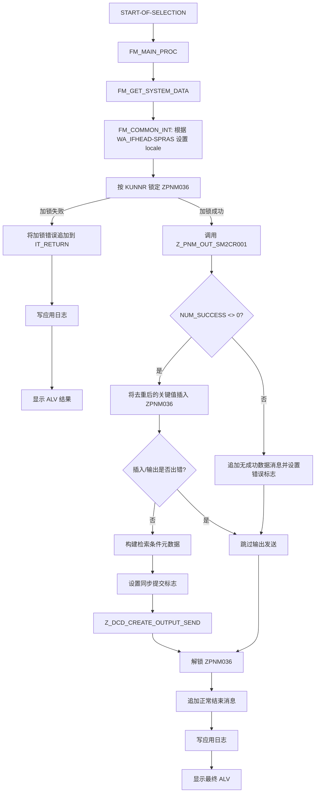

# Function Specification：ZPNMB023

## 1. 文档范围

本规格书基于 2026-07-03 通过 SE38 导出的 ABAP 源码，导出目录为：

`D:\SAPskillhub\output\se38_export_ZPNMB023_20260703_082803`

本次业务分析不包含 `SAPLSE16N.abap`。该文件仅用于验证 SE38 导出流程是否可用。

## 2. 程序概要

`ZPNMB023` 是一个可执行报表程序，用于执行“面向客户的个体识别编号发送/登记”处理。

程序头注释中的日文信息如下：

- 程序名称：`得意先向け個体識別番号送信`
- 程序概要：`得意先向け個体識別番号送信`
- 概要设计书编号：`MM_Z053`
- 使用条件：仅可在 SAP S/4HANA 服务器上使用
- 消息类：`ZPNM001`

从功能上看，该报表是一个流程控制型程序。它负责选择画面输入校验、权限检查、按客户加锁、调用业务数据抽取/输出函数模块、将成功输出的关键值登记到 `ZPNM036`、调用共通配信 Include 完成 EAI/文件输出和应用日志记录，最后显示 ALV 处理结果画面。

报表本身不直接读取详细业务输出数据。实际业务数据由函数模块 `Z_PNM_OUT_SM2CR001` 生成。

## 3. 导出的源码集合

### 3.1 INCLUDE 层级

```text
ZPNMB023
├─ ZPNMB023TOP
├─ ZDCDF001
│  ├─ ZDCDF001TOP
│  └─ ZDCDF001F01
└─ ZPNMB023F01
```

### 3.2 各程序职责

| 程序 | 导出文件 | 职责 |
|---|---|---|
| `ZPNMB023` | `ZPNMB023.abap` | 主报表，定义事件块并组合各 INCLUDE |
| `ZPNMB023TOP` | `ZPNMB023-INCLUDE-ZPNMB023TOP.abap` | 本业务专用的全局数据、常量、选择画面 |
| `ZPNMB023F01` | `ZPNMB023-INCLUDE-ZPNMB023F01.abap` | 本业务专用的输入校验、权限检查、主处理、`ZPNM036` 登记，以及对共通输出处理的包装调用 |
| `ZDCDF001` | `ZPNMB023-INCLUDE-ZDCDF001.abap` | 共通配信/报表 Include 入口；追加共通初始化和选择画面校验事件 |
| `ZDCDF001TOP` | `ZDCDF001-INCLUDE-ZDCDF001TOP.abap` | 共通输出/日志相关的全局变量、常量、接口/文件选择块 |
| `ZDCDF001F01` | `ZDCDF001-INCLUDE-ZDCDF001F01.abap` | 共通文件/EAI 输出、应用日志、ALV 结果显示、动态标签处理 |

## 4. 选择画面

最终选择画面由 `ZPNMB023TOP` 与 `ZDCDF001TOP` 共同组成。

### 4.1 业务选择字段

| 字段 | 类型 | 必输 | 说明 |
|---|---:|---:|---|
| `P_KUNNR` | `ZPNMEKUNNR` | 是 | 客户/接收方客户。通过 `BUT000` 与配置的 BP Group 校验。 |
| `P_WERKS` | `T001L-WERKS` | 是 | 工厂。通过 `T001W` 校验；同时用于派生公司代码并做权限检查。 |
| `S_LGORT` | `T001L-LGORT` | 是 | 存储地点范围。 |
| `S_MATNR` | `MATNR` | 是 | 物料范围。 |
| `S_BUDAT` | `BUDAT` | 是 | 过账/转记日期范围；`NO-EXTENSION`。 |
| `S_LIFNR` | `LIFNR` | 否 | 供应商范围。 |
| `S_IDETF` | `ZPNMEIDETFH` | 否 | 个体识别编号；`NO INTERVALS`。 |
| `S_CHARG` | `MCHB-CHARG` | 否 | 批次号；`NO INTERVALS`。 |
| `CB_RCVR` | Checkbox | 否 | 恢复/再发送标志，作为 `I_RCVR` 传给 `Z_PNM_OUT_SM2CR001`。 |

### 4.2 共通配信字段

以下字段由 `ZDCDF001TOP` 在选择块 `BL_COM1` 中提供。

| 字段 | 类型 | 必输 | 说明 |
|---|---:|---:|---|
| `P_IFID` | `ZDCDEIFID` | 是 | Interface ID。通过 `ZDCDIFT01` 校验。 |
| `P_SYSID` | `ZDCDESYSID` | 是 | System ID。通过 `ZDCDIFT02` 校验。 |
| `CB_FOUT` | Checkbox | 否 | 是否允许覆盖输出目标。 |
| `P_LOGFNM` | `C(60)` | 条件必输 | 逻辑文件名。与物理路径覆盖互斥。 |
| `P_FPATH` | `ZDCDEFILEPATH` | 条件必输 | 输出文件路径。必须与 `P_FNAME` 同时输入。 |
| `P_FNAME` | `ZDCDEFILENAME` | 条件必输 | 输出文件名。必须与 `P_FPATH` 同时输入。 |

共通选择块会拒绝不一致的文件覆盖输入：

- 如果勾选 `CB_FOUT`，必须输入逻辑文件名或文件路径。
- 逻辑文件名和物理文件路径不能同时输入。
- 物理文件路径和文件名必须成对输入。
- 如果接口发送模式不允许更新输出表关联标志，则不允许覆盖文件输出目标。

## 5. 初始化处理

由于共通 Include 位于主报表自身初始化块之前，ABAP 中存在多个 `INITIALIZATION` 事件块。

执行职责如下：

1. `ZDCDF001` 的初始化调用 `FM_ZDCDF001_INITIALIZATION`。
   - 清空 `FLG_COMMIT_SYNC`。
2. `ZPNMB023` 的初始化调用 `FM_INITIAL_PROC`。
   - 调用 `FM_SET_LBLTEXT`，从 DDIC 数据元素动态设置共通选择画面文本。
   - 调用 `FM_GET_COMMON_PARM`，读取共通参数。

`FM_GET_COMMON_PARM` 通过 `Z_DCD_COMMON_PARAMS` 读取两个必要值：

| 参数 ID | 目标变量 | 用途 |
|---|---|---|
| `BP_GROUP` | `WK_BU_GROUP` | BP 分组，用于在 `BUT000` 中校验 `P_KUNNR`。 |
| `OBJCT` | `WK_OBJCT` | 权限对象名称，用于 `AUTHORITY-CHECK`。 |

如果任一共通参数无法读取，则抛出错误消息 `ZPNM001-602`。

## 6. 输入校验

### 6.1 接口与文件输出校验

`AT SELECTION-SCREEN ON BLOCK BL_COM1` 调用 `FM_INPUT_CHECK_BL_COM1`。

校验顺序：

1. `P_IFID` 必须存在于 `ZDCDIFT01`，且 `LOEVM <> ABAP_TRUE`。
2. `P_SYSID` 必须存在于 `ZDCDIFT02`，且 `LOEVM <> ABAP_TRUE`。
3. 使用 `WA_EXINFO-IFID` 与 `WA_EXINFO-SYSID` 调用 `Z_DCD_GET_FILEPARAM`。
4. 返回的 `WA_IFHEAD` 不能为初始值。
5. 按第 4.2 节的规则检查文件输出覆盖参数组合。

校验失败时，以错误样式显示 `ZDCD001` 消息，并执行 `LEAVE SCREEN`。

### 6.2 客户校验

`AT SELECTION-SCREEN ON P_KUNNR` 调用 `FM_INPUT_CHECK_KUNNR`。

程序执行如下检查：

```abap
SELECT SINGLE PARTNER
  FROM BUT000
 WHERE PARTNER  = P_KUNNR
   AND BU_GROUP = WK_BU_GROUP.
```

失败时抛出 `ZPNM001-612`，消息变量中包含配置的 BP Group。

### 6.3 工厂校验

`AT SELECTION-SCREEN ON P_WERKS` 调用：

1. `FM_INPUT_CHECK_WERKS`
2. `FM_CHECK_AUTH`

`FM_INPUT_CHECK_WERKS` 校验 `P_WERKS` 是否存在于 `T001W`。失败时抛出 `ZPNM001-612`。

### 6.4 权限检查

`FM_CHECK_AUTH` 通过 `T001W` 与 `T001K` 的关联，从工厂派生公司代码：

```abap
SELECT BUKRS
  FROM T001W INNER JOIN T001K
    ON T001W~BWKEY = T001K~BWKEY
 WHERE T001W~WERKS = P_WERKS
 ORDER BY BUKRS.
```

随后执行：

```abap
AUTHORITY-CHECK OBJECT WK_OBJCT
  ID 'BUKRS' FIELD L_BUKRS
  ID 'ACTVT' FIELD '01'.
```

权限失败时的行为：

- 在线执行：抛出错误 `ZPNM001-638`。
- 后台执行：以错误样式显示同一消息，然后 `LEAVE PROGRAM`。

## 7. 主处理流程

`START-OF-SELECTION` 事件调用 `FM_MAIN_PROC`。

### 7.1 高层流程



### 7.2 开始消息与系统数据

`FM_MAIN_PROC` 调用 `FM_GET_SYSTEM_DATA`，后者委托 `Z_DCD_EDIT_SYSDATA` 填充 `WA_SYSDATA`。

该系统数据随后用于插入 `ZPNM036` 的审计字段：

- `CREDATE`
- `CRETIME`
- `CREUSER`
- `CREPROG`
- `CRETRAN`

报表使用 `P_KUNNR` 显示开始消息 `ZPNM001-641`。

### 7.3 Locale 处理

业务输出前，`FM_COMMON_INT` 设置 locale 语言：

```abap
IF WA_IFHEAD-SPRAS IS NOT INITIAL.
  SET LOCALE LANGUAGE WA_IFHEAD-SPRAS.
ENDIF.
```

这表示文件、日志、输出格式会跟随所选接口/系统配置中的接口头语言。

### 7.4 加锁

报表按客户端和客户锁定自定义对象/表区域 `ZPNM036`：

```abap
CALL FUNCTION 'ENQUEUE_EZZZPNM036_1'
  EXPORTING
    MANDT = SY-MANDT
    KUNNR = P_KUNNR.
```

如果加锁失败：

- 显示 SAP 系统锁消息。
- 将业务错误消息 `ZPNM001-643` 追加到 `IT_RETURN`。
- 执行应用日志输出和 ALV 显示。
- 主处理直接返回，不调用业务抽取函数模块。

如果加锁成功，程序后续会用相同客户端和客户调用 `DEQUEUE_EZZZPNM036_1` 解锁。

## 8. 业务数据抽取接口

核心业务数据模块为：

```abap
CALL FUNCTION 'Z_PNM_OUT_SM2CR001'
  EXPORTING
    I_KUNNR    = P_KUNNR
    I_WERKS    = P_WERKS
    IT_S_LGORT = S_LGORT[]
    IT_S_MATNR = S_MATNR[]
    IT_S_BUDAT = S_BUDAT[]
    IT_S_LIFNR = S_LIFNR[]
    IT_S_IDETF = S_IDETF[]
    IT_S_CHARG = S_CHARG[]
    I_RCVR     = CB_RCVR
  IMPORTING
    ET_RETURN     = IT_RETURN
    ET_OUTPUTDATA = IT_OUTPUTDATA
    ES_DATANUM    = L_WA_DATANUM.
```

可观察到的接口契约如下：

| 方向 | 参数 | 类型 / 来源 | 含义 |
|---|---|---|---|
| Import | `I_KUNNR` | `P_KUNNR` | 客户/接收方客户 |
| Import | `I_WERKS` | `P_WERKS` | 工厂 |
| Import | `IT_S_LGORT` | `S_LGORT[]` | 存储地点过滤条件 |
| Import | `IT_S_MATNR` | `S_MATNR[]` | 物料过滤条件 |
| Import | `IT_S_BUDAT` | `S_BUDAT[]` | 日期过滤条件 |
| Import | `IT_S_LIFNR` | `S_LIFNR[]` | 供应商过滤条件 |
| Import | `IT_S_IDETF` | `S_IDETF[]` | 个体识别编号过滤条件 |
| Import | `IT_S_CHARG` | `S_CHARG[]` | 批次过滤条件 |
| Import | `I_RCVR` | `CB_RCVR` | 恢复/再发送标志 |
| Export | `ET_RETURN` | `IT_RETURN` | 处理消息 |
| Export | `ET_OUTPUTDATA` | `IT_OUTPUTDATA` | 输出目标记录，类型 `ZPNM_OUT_SM2CR001_ST01` |
| Export | `ES_DATANUM` | `L_WA_DATANUM` | 处理件数、成功件数、错误件数 |

`Z_PNM_OUT_SM2CR001` 的内部逻辑不在本次导出的源码集合中，因此本规格书将其视为外部依赖，仅记录 `ZPNMB023` 中可见的调用契约。

## 9. ZPNM036 登记

如果 `L_WA_DATANUM-NUM_SUCCESS <> 0`，报表调用 `FM_INSERT_ZPNM036`。

### 9.1 去重键

输出数据先按以下字段排序并去重：

1. `KUNNR`
2. `WERKS`
3. `IDETF`
4. `ZZWERKS`
5. `MATNR`

### 9.2 插入字段

对每条去重后的输出记录，程序为表 `ZPNM036` 构建一行数据：

| ZPNM036 字段 | 来源 |
|---|---|
| `KUNNR` | 输出记录 `KUNNR` |
| `WERKS` | 输出记录 `WERKS` |
| `IDETF` | 输出记录 `IDETF` |
| `ZZWERKS` | 输出记录 `ZZWERKS` |
| `MATNR` | 输出记录 `MATNR` |
| `CREDATE` | `WA_SYSDATA-CREDATE` |
| `CRETIME` | `WA_SYSDATA-CRETIME` |
| `CREUSER` | `WA_SYSDATA-CREUSER` |
| `CREPROG` | `WA_SYSDATA-CREPROG` |
| `CRETRAN` | `WA_SYSDATA-CRETRAN` |

插入语句为：

```abap
INSERT ZPNM036 FROM TABLE L_IT_ZPNM036 ACCEPTING DUPLICATE KEYS.
```

`SY-SUBRC = 0` 和 `SY-SUBRC = 4` 被视为可接受。其他结果会触发：

- `ROLLBACK WORK`
- 消息 `ZPNM001-607`
- 将错误详情追加到 `IT_RETURN`
- 设置 `L_ERRFLG = 'X'`

如果 `Z_PNM_OUT_SM2CR001` 未返回成功记录，则程序追加消息 `ZPNM001-646` 并设置错误标志。

## 10. 检索条件元数据

如果未设置错误标志，`FM_SRCH_DATA_SET` 会将选择画面输入转换为 `IT_SRCH_KEY_INFO`，行类型为 `ZDCD_SERCHKEY_S01`。

每行包含：

- `SIGN`
- `OPTION`
- `LOW`
- `HIGH`
- `PARAMID`

参数 ID 定义在 `C_PARA_ID` 中：

| 选择输入 | `PARAMID` |
|---|---|
| `P_KUNNR` | `IT_KUNNR` |
| `P_WERKS` | `IT_WERKS` |
| `S_LGORT` | `IT_LGORT` |
| `S_MATNR` | `IT_MATNR` |
| `S_BUDAT` | `IT_BUDAT` |
| `S_LIFNR` | `IT_LIFNR` |
| `S_IDETF` | `IT_IDETF` |
| `S_CHARG` | `IT_CHARG` |
| `CB_RCVR` | `CB_RCVR` |

这些元数据会传给共通输出处理，使 EAI/文件输出可以保留原始检索条件。

## 11. 共通输出处理

业务专用包装 FORM `FM_OUTPUT_DATA_Z053`、`FM_OUTPUT_LOG_Z053`、`FM_ALV_DISPLAY_Z053` 直接委托给 `ZDCDF001F01` 中的共通 FORM。

### 11.1 输出发送

`FM_OUTPUT_DATA` 调用：

```abap
CALL FUNCTION 'Z_DCD_CREATE_OUTPUT_SEND'
  EXPORTING
    IS_EXINFO     = WA_EXINFO
    IT_DATA       = V_IT_OPTRG_DATA
    IT_SERCHKEY   = V_IT_SRCH_KEY_INFO
    IS_FILEOPT    = L_WA_FILEOPT_S01
    IS_DATANUM    = V_IS_DATANUM
    I_SYNC_COMMIT = FLG_COMMIT_SYNC
  IMPORTING
    E_GUID        = V_ES_GUID
    E_FILEPATH    = V_ES_OP_FPATH
    E_NUM_OUT     = V_ES_NO_ITM_PROC
    E_NUM_SUCCESS = V_ES_NO_SUCCESS
    E_NUM_ERROR   = V_ES_NO_FAILURE
    ET_ERRMSG     = L_IT_ERR_MSG.
```

调用该模块前，`ZPNMB023` 会设置：

```abap
FLG_COMMIT_SYNC = ABAP_ON.
```

如果输出模块失败且同步提交标志为开启，共通输出执行 `ROLLBACK WORK`。

当输出模块返回详细错误行时，共通 Include 会根据 `WA_IFHEAD-OUTKEY` 配置，从失败的输出记录中复制输出关键字段，并转换为处理结果表记录。

如果未返回 GUID，共通 Include 会通过以下方式生成一个：

```abap
CL_SYSTEM_UUID=>IF_SYSTEM_UUID_STATIC~CREATE_UUID_C32
```

### 11.2 文件覆盖

如果 `CB_FOUT = ABAP_TRUE`，共通输出传入覆盖值：

| 共通输出选项 | 选择画面来源 |
|---|---|
| `LOGFNAME` | `P_LOGFNM` |
| `FILEPATH` | `P_FPATH` |
| `FILENAME` | `P_FNAME` |

否则文件输出目标由 `WA_IFHEAD` 中返回的接口/文件参数配置决定。

## 12. 应用日志

`FM_OUTPUT_LOG` 使用类 `ZCL_DCD_APPLICATION_LOG` 写应用日志。

日志对象/子对象选择逻辑：

1. 如果 `WA_IFHEAD-OBJECT` 和 `WA_IFHEAD-SUBOBJECT` 有值，则使用它们。
2. 否则调用 `Z_DCD_COMMON_PARAMS`，参数为：
   - program ID：`Z_DCD_REQUEST_OUTPUT`
   - parameter ID：`APPLICATION_LOG`
3. 如果共通参数不可用，则回退为：
   - object：`ZDCDIF002`
   - subobject：`GENERAL`

对于每条处理结果记录，外部日志编号由以下内容拼接而成：

```text
GUID + KEYVAL1 + KEYVAL2 + ... + KEYVAL10
```

上下文结构 `ZDCD_CONTEXT_S01` 包含：

- `IFID`
- `SYSID`
- `GUID`
- 顺序行号

如果处理结果行包含完整消息身份信息（`MSGTY`、`MSGID`、`MSGNO`），则直接用这些值写日志。否则，将长错误文本拆分到消息变量中，并以 `ZDCD001-161` 写入。

日志保存使用 `I_IN_UPDATE_TASK = ABAP_FALSE` 立即执行，随后刷新日志对象。

## 13. ALV 结果显示

`FM_ALV_DISPLAY` 使用以下组件构建 ALV 结果画面：

- `REUSE_ALV_FIELDCATALOG_MERGE`
- 结构 `ZDCD_ALV_S01`
- `REUSE_ALV_GRID_DISPLAY`
- top-of-page 回调 `FM_TOP_OF_PAGE`

ALV 表头显示：

- GUID
- 输出文件路径，按 60 字符分段显示
- 处理对象件数
- 成功件数
- 失败件数

字段目录会动态调整：

- 根据 `WA_IFHEAD-KEYVAL*` 隐藏未使用的 `KEYVAL1` 到 `KEYVAL10` 列。
- 对已使用的 key 列，根据 `WA_IFHEAD-STRNAME` 从 `DD03L` 与 `DD04T` 取得字段标签。
- 隐藏 `MSGV1` 到 `MSGV4`。

后台执行时，如果 `WA_IFHEAD-JOBERROR3 = ABAP_ON` 且至少一条结果记录 `MSGTY = 'E'`，共通 Include 会抛出错误 `ZDCD001-062`。

## 14. 结束处理

输出处理或错误处理之后：

1. 通过 `DEQUEUE_EZZZPNM036_1` 释放客户锁。
2. 生成正常结束消息 `ZPNM001-647` 并追加到 `IT_RETURN`。
3. `FM_OUTPUT_LOG_Z053` 写应用日志。
4. 使用 `P_KUNNR` 显示结束消息 `ZPNM001-642`。
5. `FM_ALV_DISPLAY_Z053` 显示 ALV 处理结果。

## 15. 错误与事务行为

| 条件 | 处理 |
|---|---|
| 缺少共通参数 `BP_GROUP` 或 `OBJCT` | 初始化阶段报错 `ZPNM001-602`。 |
| `P_IFID` 无效 | 消息 `ZDCD001-017`，返回选择画面。 |
| `P_SYSID` 无效 | 消息 `ZDCD001-018`，返回选择画面。 |
| 找不到接口/文件参数头 | 消息 `ZDCD001-064`，返回选择画面。 |
| 输出覆盖参数组合无效 | 消息 `ZDCD001-024/025/026/095`，返回选择画面。 |
| 客户/BP Group 无效 | 错误 `ZPNM001-612`。 |
| 工厂无效 | 错误 `ZPNM001-612`。 |
| 权限失败 | 在线报错；后台以错误样式显示后 `LEAVE PROGRAM`；消息 `ZPNM001-638`。 |
| 客户加锁失败 | 追加 `ZPNM001-643`，写日志，显示 ALV，然后返回。 |
| 无成功业务输出数据 | 追加/显示 `ZPNM001-646`，跳过输出发送步骤。 |
| `ZPNM036` 插入技术错误 | `ROLLBACK WORK`，追加/显示 `ZPNM001-607`，跳过输出发送步骤。 |
| `Z_DCD_CREATE_OUTPUT_SEND` 错误 | 如果同步提交开启，共通输出执行 `ROLLBACK WORK`；详细错误追加到结果表。 |
| 应用日志失败 | 将 `ZDCD001-063` 追加到结果表并从日志输出返回。 |
| ALV 显示失败 | 抛出 `ZDCD001-027`。 |

## 16. 主要数据对象与依赖

### 16.1 数据库表 / 视图

| 对象 | 用途 |
|---|---|
| `BUT000` | 校验客户/BP Partner 与 BP Group。 |
| `T001W` | 校验工厂；关联估价范围以取得权限检查用公司代码。 |
| `T001K` | 根据工厂估价范围派生公司代码。 |
| `ZPNM036` | 登记去重后的成功输出个体识别关键值。 |
| `ZDCDIFT01` | 校验 Interface ID。 |
| `ZDCDIFT02` | 校验 System ID。 |
| `DD03L` | 根据配置的输出结构解析 ALV key 字段的 rollname。 |
| `DD04T` | 解析动态选择画面/ALV 标签。 |

### 16.2 函数模块与类

| 对象 | 用途 |
|---|---|
| `Z_DCD_COMMON_PARAMS` | 读取 BP Group、权限对象、共通应用日志设置。 |
| `Z_DCD_EDIT_SYSDATA` | 填充系统/审计元数据。 |
| `Z_PNM_OUT_SM2CR001` | 业务数据抽取和输出数据准备。 |
| `ENQUEUE_EZZZPNM036_1` | 按客户锁定 `ZPNM036` 处理。 |
| `DEQUEUE_EZZZPNM036_1` | 释放客户锁。 |
| `Z_DCD_GET_FILEPARAM` | 读取接口/文件输出头配置。 |
| `Z_DCD_CREATE_OUTPUT_SEND` | 创建输出文件/EAI 发送数据，并返回 GUID、路径、件数。 |
| `SELECTION_TEXTS_MODIFY` | 动态设置选择画面文本。 |
| `REUSE_ALV_FIELDCATALOG_MERGE` | 生成 ALV 字段目录。 |
| `REUSE_ALV_GRID_DISPLAY` | 显示 ALV 结果网格。 |
| `REUSE_ALV_COMMENTARY_WRITE` | 显示 ALV top-of-page 表头。 |
| `ZCL_DCD_APPLICATION_LOG` | 创建并保存应用日志。 |
| `CL_SYSTEM_UUID=>CREATE_UUID_C32` | 生成备用 GUID。 |

### 16.3 DDIC 结构与表类型

本报表使用的主要结构/表类型包括：

- `ZPNM_OUT_SM2CR001_ST01`
- `ZPNM_OUT_SM2CR001_S01`
- `ZDCD_ERRIFOP_ST01`
- `ZDCD_ERRIFOP_S01`
- `ZDCD_DATANUM_S01`
- `ZDCD_SERCHKEY_S01`
- `ZDCD_SYSDATA_S01`
- `ZDCD_FILEOPT_S01`
- `ZDCD_EXINFO_S01`
- `ZDCD_CONTEXT_S01`
- `ZDCD_ALV_S01`
- `ZDCDIFT03`

## 17. 功能总结

`ZPNMB023` 为面向客户的个体识别数据发送提供受控的报表执行路径：

1. 用户输入客户、工厂、存储地点、物料、日期、可选供应商/个体识别编号/批次、恢复标志，以及共通 IF/输出设置。
2. 报表校验客户、工厂、接口、系统、输出设置，并根据工厂派生公司代码执行权限检查。
3. 报表按客户锁定 `ZPNM036` 相关处理区域。
4. 报表委托 `Z_PNM_OUT_SM2CR001` 执行业务数据取得与输出数据构建。
5. 将成功输出的关键值登记到 `ZPNM036`，允许重复键。
6. 将选择条件转换为共通检索条件元数据。
7. 共通输出创建/发送 EAI 或文件输出，并返回 GUID、路径、件数。
8. 共通日志以 GUID 和 key context 写应用日志。
9. 报表释放锁并显示 ALV 结果画面，供操作确认。

## 18. 范围边界与未展开依赖

以下行为无法仅根据本次导出的源码完全确定，需要依赖未导出的外部对象：

- `Z_PNM_OUT_SM2CR001` 内部的精确数据选择逻辑和业务规则。
- `Z_DCD_CREATE_OUTPUT_SEND` 内部的物理文件命名、表更新、EAI 发送机制和提交策略。
- `Z_DCD_COMMON_PARAMS` 使用的共通参数存储位置和维护方式。
- `ZPNM036`、`ZPNM_OUT_SM2CR001_S01`、`ZDCD_ALV_S01` 等自定义 DDIC 对象的字段定义和领域语义。
- `TEXT-001`、`TEXT-002`、`TEXT-003` 等文本元素，以及 `ZPNM001` / `ZDCD001` 消息长文本的实际内容。

在本次导出的 ABAP 范围内，`ZPNMB023` 可以理解为 MM_Z053“面向客户的个体识别编号发送”的报表级控制器，以及持久化、日志、结果展示的协调程序。
